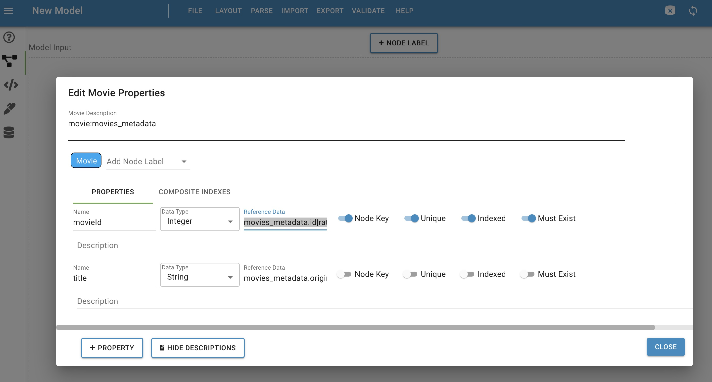

# SNACC
Spark Neo4j Automatic Code Creator

# Introduction

Welcome to the SNACC (pronounced 'snack') project. SNACC is a utility to automatically generate a notebook with code utilizing the [Neo4j Spark Connector](https://neo4j.com/docs/spark/current/) to provide an engineer the means to get a 'jump start' on ingesting their data into Neo4j. The concept of the utility is to drive it completely from a data model created in [Neo4j Solutions Workbench](https://cw.neo4j.solutions/). At a high-level, the steps are:

* Create the data model
* Run tool against data model
* Ingest data into Neo4j via the notebook generated from the tool
* Repeat the above for any updates to the data model

# Prerequisites

The project runs on docker compose so having docker/docker compose is necessary (tested with Docker v20.10.14/Docker Compose V2).

# Steps to follow

## Data Model

The data model created as an exmaple is based on data at a Kaggle movie-based data [project](https://www.kaggle.com/datasets/rounakbanik/the-movies-dataset?select=movies_metadata.csv). The overall concept is to ingest user data and relate it to movies by a user's rating. This is a simple example of a data model and could certainly be evolved and interated on easily with the tool generating the needed updated code to reingest.

The datamodel output from is located in the project at [spark/data/model/movies_datamodel.json](spark/data/model/movies_datamodel.json). Along with that, the supporting data used for ingest is located at [spark/data/csv/](spark/data/model/csv/) and included two CSV files: movies_metadata.csv and ratings.csv.

The overall data mode is shown in the first image below. In the second image, we see the more detailed view of the Movies node. The data model is designed as usual; however, in the case of the tool, we've added a couple of other pieces of metadata to assist the tool in mapping the data. Namely, in the top description field "movie:movies_metadata" has been added - this is basically stating that I'm mapping the Movie node (added as 'movie' in lower-case) to the movies_metadata csv). 

Addtionally, within each property's description field, we have the mapping of the data columm to the Node property name -  this is the pattern followed by the spark connector using node.keys (read up on [nodes.keys](https://neo4j.com/docs/spark/current/writing/#write-node))

A further example of the metadata added to the property is the title property contains 'movies_metadata.original_title' within it's description. By having this here, it helps the tool derive that the title property's data will come from the original_title column in the movies_metadata CSV file. One other example is the case of the movieId property having description of 'movies_metadata.id|ratings.movieId' The first part of this value (before the pipe character) is stating that the id column from the movies_metadata CSV is mapping to the movieId property. The second value (after the pipe character), is optional, and in this case is saying that the movieId value from the ratings CSV is used to key the movieId in a relationship query. NOTE: Once you review the output of the code and look at how the relationship queries are mapped, it may be more clear. This optional pattern isn't particularly intuitive and will be potentially be refactored to not have this workaround. 

Detailed View

# Steps to Run

The following are the steps to run the project. Under the covers, the code run will read the datamodel and parse it, generate the needed cyper/configuration to create the new database with necessary constraints, and generate the code using the spark connector to read in the data an create the nodes/relationships within the data model: 

* Clone the project
  
* The project has a fully functional jupyter labs and neo4j instance running within the docker compose. From a terminal run the following from the root of the project: docker-compose up

* Go to the jupyter labs local site (look at output in docker consolse for url - similar to below):

  - http://127.0.0.1:8888/lab?token=534e17d720fc0288750759cb881d8b373777194802058471

* Go to the "work" directory in the notebook

* Open a terminal in the notebook and run: python3 create_notebook.py

* Run entire notebook (starting pyspark kernel). This will take around a minute. 

* Once the notebook as completed, open neo4j browser and view the data in the 'autoneo' database:

  - http://localhost:7774/browser/ 

   (user: neo4j password: password123)
